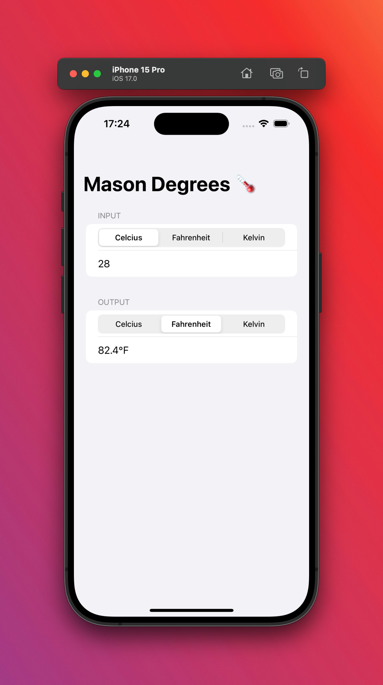
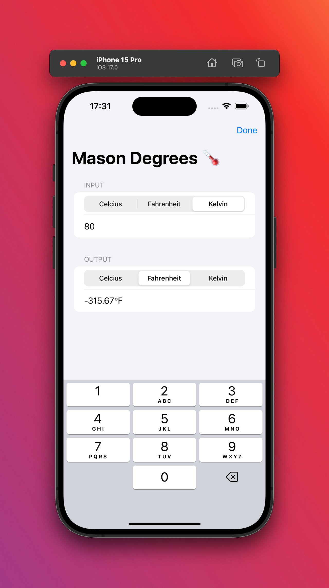

# MasonDegrees
Simple SwiftUI app for temperature conversion between Celcius, Fahrenheit, and Kelvin temperature units.

 

Made by Mason Cao - Nov 2023.

Completed as the first challenge of Project 1, from the 100 Days of Swift Course by Paul Hudson @ Hacking with Swift
